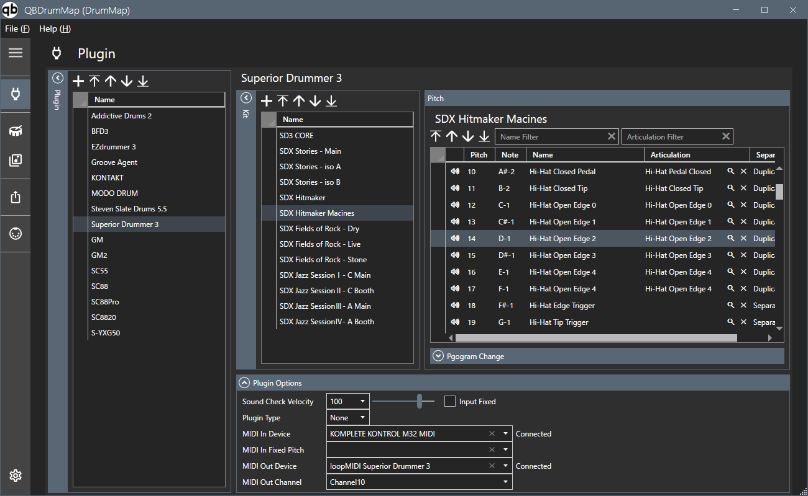

# QBDrumMap

DAW(Studio One、Cubase)で使用するドラムマップのエディターです。

## システム要件
OSはWindowsのみの対応となります。  
Studio One Pro Windowsシステムの要件に準拠します。
## 概要
このプログラムは、異なるドラム音源やDAW間で共通のドラムマップを利用できるようにするためのツールです。  
音源ごとに異なるアーティキュレーションやピッチの違いを統一的に管理し、基準マップを元に変換やマッピングを行えるようにします。  
また、マップ作成時にサウンドチェックを行える機能を備え、利便性を高めます。
## ダウンロード・インストール
+ 手順
    1. この画面右に表示されているReleaseよりダウンロードしてください。
    2. ダウンロードしたzipの任意の場所に展開します。
    3. フォルダ内の"QB DrumMap.exe"がプログラム本体になります。

レジストリは使用していないので、不要になった場合はフォルダ毎削除してください。
## サンプルデータ
マップファイル"DrumMap.qbd"を同梱してます。
Addictive Drum 2やBFD3などメジャーなドラム音源のドラムマップやドラムパーツ・アーティキュレーションがあらかじめ登録されていますので、必要に応じて参照してください。
## 免責事項
本ソフトウェアは「フリーソフト」であり、個人での利用に限り無償で使用可能とします。
本ソフトウェアは、その不具合、または、本ソフトウェアを利用することによって生じたあらゆる損害について、作者または提供者は一切の責任を負いません。
ソフトウェアの入手および利用は、利用者の自己の責任と費用により行ってください。
本ソフトウェアは、予告なく提供を中止することがあります。本提供の終了によって、利用者および第三者に発生した損失や損害について、作者または提供者は一切責任を負いません。
