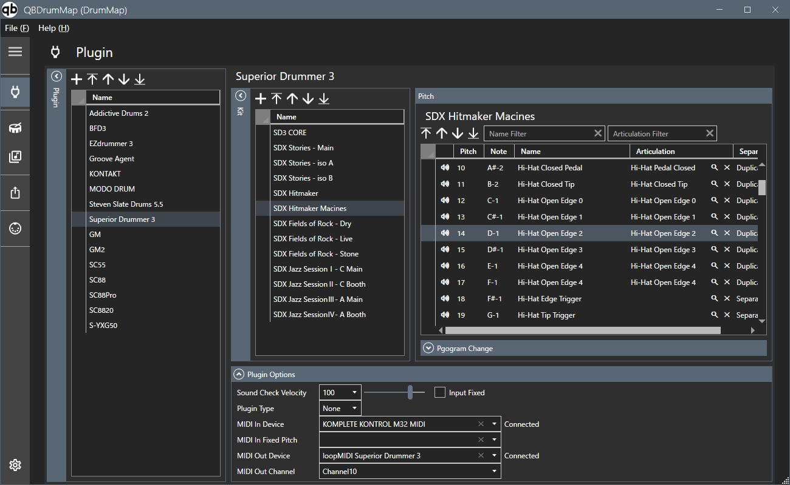

# QBDrumMap

DAW（Studio One、Cubase）で使用する **ドラムマップ編集ツール** です。  

A **drum map editor** for use with DAWs such as **Studio One** and **Cubase**.

---

## 🎥 Demo Video

QBDrumMapの基本コンセプト、画面構成、  
ドラムマップ変換・エクスポートの流れを動画で確認できます。

This video shows the basic concept, UI overview,  
and the workflow for drum map conversion and export.

---

## システム要件 | System Requirements

OSは **Windows のみ対応** です。  
Studio One Pro（Windows版）のシステム要件に準拠します。

Windows only.  
System requirements follow **Studio One Pro (Windows)** specifications.

---

## 概要 | Overview

このプログラムは、  
**異なるドラム音源や DAW 間で共通のドラムマップを利用**できるようにするためのツールです。

音源ごとに異なるアーティキュレーションやピッチの違いを  
**統一的に管理**し、基準マップを元に変換・マッピングを行えます。

また、マップ作成時に **サウンドチェックを行える機能** を備えています。

---

This tool allows you to use **a common drum map across different drum instruments and DAWs**.

It manages differences in articulations and note pitches between instruments  
and converts them based on a reference drum map.

A built-in **sound check feature** is provided for efficient map creation.

---

## ダウンロード・インストール | Download & Installation

### 手順 | Steps

1. このページ右側の **Releases** からダウンロードしてください。  
2. ダウンロードした zip を任意の場所に展開します。  
3. フォルダ内の **`QB DrumMap.exe`** がプログラム本体です。

---

1. Download the latest release from **Releases** on this page.  
2. Extract the downloaded zip file to any location.  
3. Run **`QB DrumMap.exe`**.

レジストリは使用していません。  
不要になった場合は **フォルダごと削除**してください。

The application does not use the Windows registry.  
To uninstall, simply delete the folder.

---

## サンプルデータ | Sample Data

マップファイル **`DrumMap.qbd`** を同梱しています。

Addictive Drums 2、BFD3 など  
主要なドラム音源向けのドラムマップ、  
ドラムパーツ、アーティキュレーションが  
あらかじめ登録されています。

---

A sample map file **`DrumMap.qbd`** is included.

It contains predefined drum maps, drum parts, and articulations  
for major drum instruments such as **Addictive Drums 2** and **BFD3**.

---

## 免責事項 | Disclaimer

本ソフトウェアは無償で提供されます。  
本ソフトウェアの使用または使用不能から生じる  
いかなる損害についても、作者は一切の責任を負いません。

本ソフトウェアは予告なく提供を中止することがあります。

---

This software is provided **as is**, free of charge.  
The author assumes no responsibility for any damages  
resulting from the use or inability to use this software.

The software may be discontinued without prior notice.

---

## 📄 ライセンス | License

MIT License
